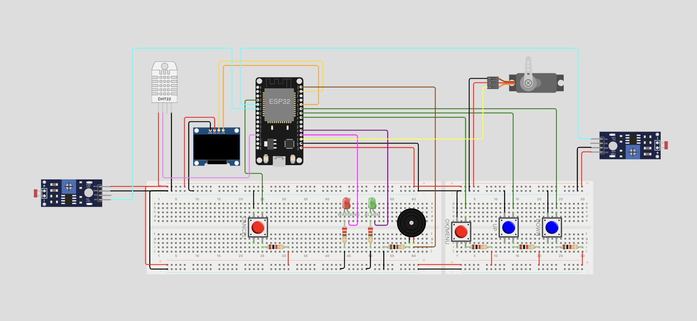
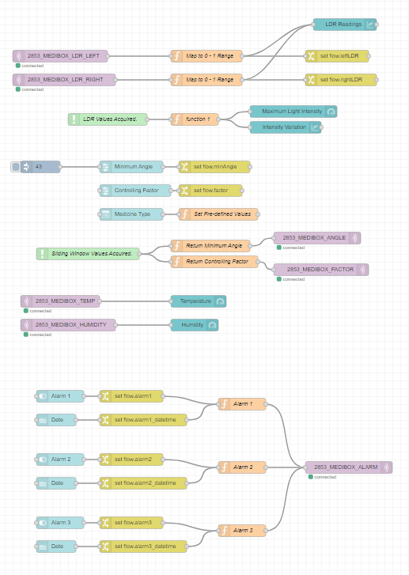
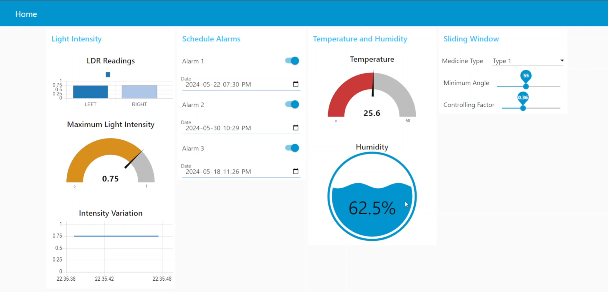

# Medibox Project

## Overview

The Medibox is a smart, IoT-enabled device designed to help users manage their medication schedules effectively. The device is powered by an ESP32 microcontroller and features various sensors and actuators to monitor and regulate environmental conditions, ensuring optimal storage conditions for medications. Additionally, it includes a user-friendly interface for setting medication reminders and monitoring environmental parameters.

## Features

1. **Time Zone and Alarm Management:**
   - Set time zone by entering the offset from UTC.
   - Set up to three alarms for medication reminders.
   - Disable all alarms with a single command.

2. **Real-Time Clock:**
   - Fetch the current time from the NTP server based on the selected time zone.
   - Display the current time on an OLED screen.

3. **Alarm Functionality:**
   - Ring an alarm with appropriate indications (e.g., buzzer, LED, message on OLED) when the set alarm times are reached.
   - Stop the alarm using a push button.

4. **Environmental Monitoring:**
   - Monitor temperature and humidity levels using sensors.
   - Display warnings when temperature or humidity exceeds healthy limits.
     - Healthy Temperature: 26°C ≤ Temperature ≤ 32°C
     - Healthy Humidity: 60% ≤ Humidity ≤ 80%

5. **Light Intensity Monitoring:**
   - Measure light intensity using two Light Dependent Resistors (LDRs) placed on either side of the Medibox.
   - Display the highest light intensity on the Node-RED dashboard using a gauge and a plot.
   - Indicate which LDR (left or right) has recorded the highest intensity.

6. **Automatic Light Regulation:**
   - Adjust the angle of a shaded sliding window using a servo motor to regulate light intensity entering the Medibox.
   - Implement the following equation to control the servo angle:
     $$
     \theta = \min\{\theta_{\text{offset}} \times D + (180^{\circ} - \theta_{\text{offset}}) \times I \times \gamma, 180^{\circ}\}
     $$
     - $\theta$ is the motor angle.
     - $\theta_{\text{offset}}$ is the minimum angle (default value: 30 degrees).
     - $I$ is the maximum light intensity (range: 0 to 1).
     - $\gamma$ is the controlling factor (default value: 0.75).
     - $D = 0.5$ if right LDR gives max intensity; $D = 1.5$ if left LDR gives max intensity.

7. **Customizable Parameters:**
   - Provide sliders in the Node-RED dashboard to adjust the minimum angle and controlling factor.
   - Include a dropdown menu to select commonly used medicines with predefined settings or to manually customize settings.

## Project Structure

- `ESP32_Code/`: The PlatformIO project directory containing the source code for the ESP32 microcontroller.
- Wokwi Simulation: [View Wokwi Simulation](https://wokwi.com/projects/391892682569523201)
- `NodeRED_Flow.json`: NodeRED Flow file.

## Getting Started

### Prerequisites

- ESP32 microcontroller
- Sensors: Temperature, Humidity, LDRs
- Actuators: Servo Motor, Buzzer, Push Button, LEDs
- OLED display
- Wi-Fi connection for NTP time synchronization
- Node-RED and MQTT broker setup

### Setup Instructions

1. **Microcontroller Programming:**
   - Open the `ESP32_Code/` directory in PlatformIO within VS Code.
   - Compile and upload the code to the ESP32.
   - Ensure all sensors and actuators are connected as per the Wokwi simulation.

2. **Node-RED Setup:**
   - Import the Node-RED flow `NodeRED_Flow.json` into your Node-RED instance.
   - Configure the MQTT broker to use `test.mosquitto.org` or your preferred broker.
   - Deploy the flow and verify that the dashboard is functioning correctly.

3. **Usage:**
   - Navigate through the menu on the OLED screen to set the time zone and alarms.
   - Monitor the temperature, humidity, and light intensity on the Node-RED dashboard.
   - Adjust the minimum angle and controlling factor for the shaded sliding window as needed.

## Visualization

### Wokwi Simulation

### Node-RED Flow

### Node-RED Dashboard

